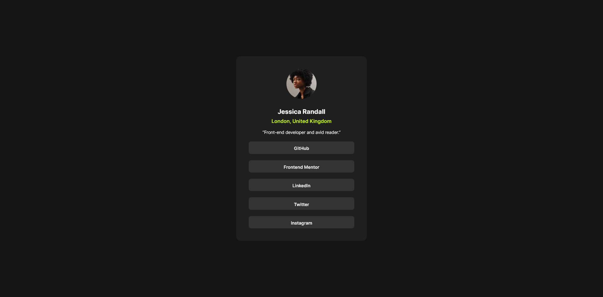

# Frontend Mentor - Social links profile solution

This is a solution to the [Social links profile challenge on Frontend Mentor](https://www.frontendmentor.io/challenges/social-links-profile-UG32l9m6dQ). Frontend Mentor challenges help you improve your coding skills by building realistic projects. 

## Table of contents

- [Overview](#overview)
  - [The challenge](#the-challenge)
  - [Screenshot](#screenshot)
  - [Links](#links)
- [My process](#my-process)
  - [Built with](#built-with)
  - [Continued development](#continued-development)
- [Author](#author)

## Overview

### The challenge

Users should be able to:

- See hover and focus states for all interactive elements on the page

### Screenshot

### Links

- Solution URL: [Add solution URL here](https://your-solution-url.com)
- Live Site URL: [Add live site URL here](https://kylecreate-sociallinks.netlify.app/)

## My process

### Built with

- Semantic HTML5 markup
- CSS custom properties
- Flexbox
- CSS Grid
- Mobile workflow

### Continued development

I'm planning on working through the roadmap created by the moderators/site staff of frontend mentor on their Discord server. You can also check out my [100 Days of Code](https://github.com/kylecreate/100DaysOfCode) challenge on my GitHub!

## Author

- Frontend Mentor - [@kylecreate](https://www.frontendmentor.io/profile/kylecreate)
- Twitter - [@kylecreate](https://www.twitter.com/kylecreate)